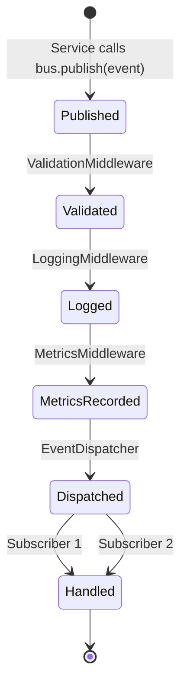
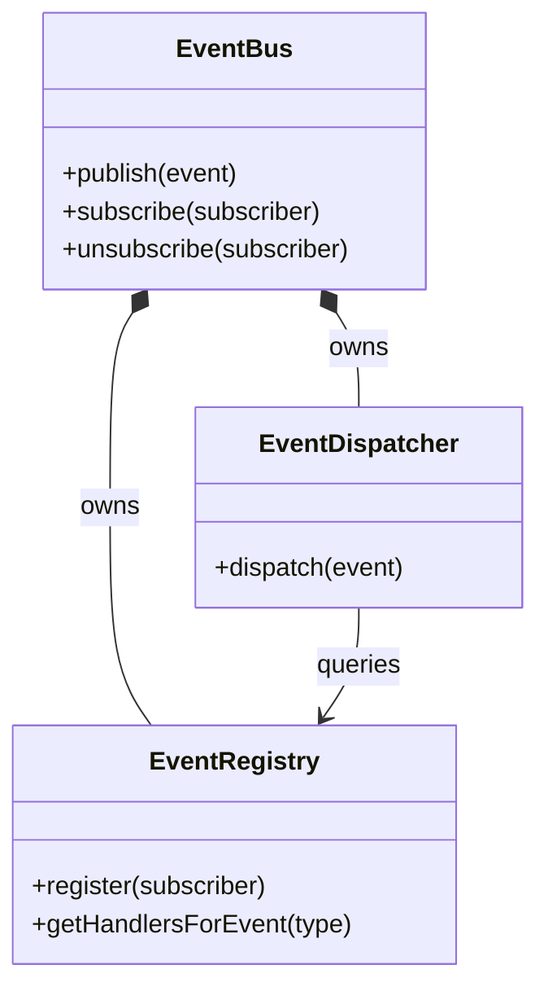
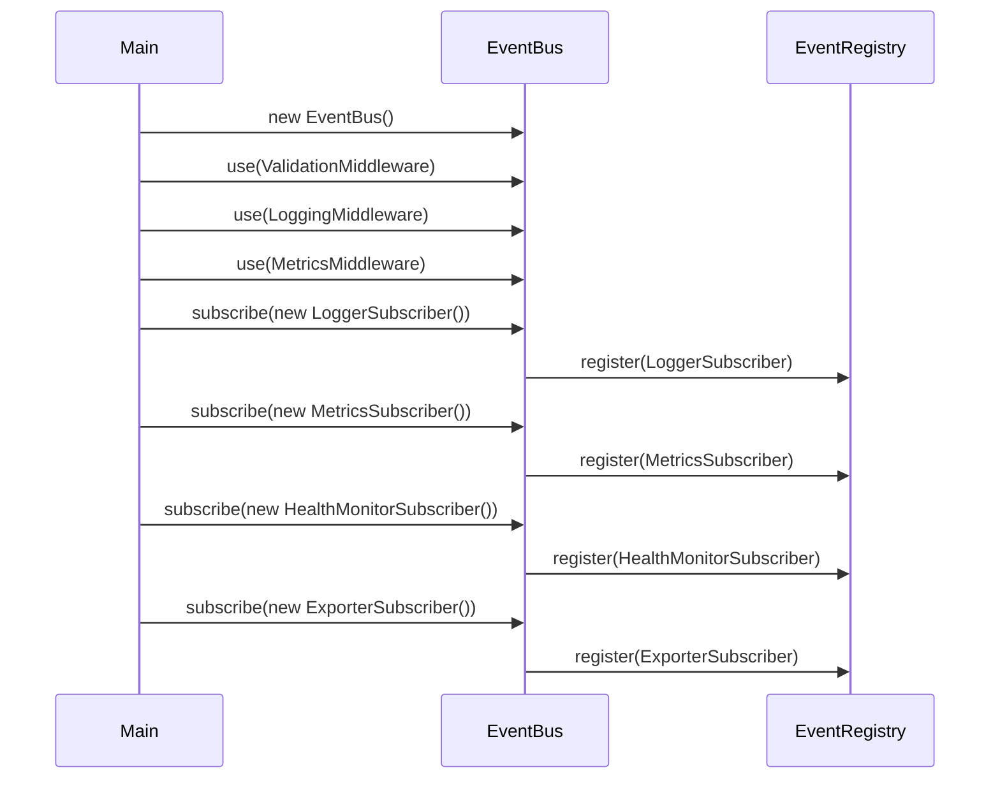

# Event Bus

The Event Bus acts as the central hub of the Runtime Messaging Layer.

## Event Lifecycle Diagram

```mermaid
stateDiagram-v2
    [*] --> Published: Service calls bus.publish(event)
    Published --> Validated: ValidationMiddleware
    Validated --> Logged: LoggingMiddleware
    Logged --> MetricsRecorded: MetricsMiddleware
    MetricsRecorded --> Dispatched: EventDispatcher
    Dispatched --> Handled: Subscriber 1
    Dispatched --> Handled: Subscriber 2
    Handled --> [*]
```

## Event Ownership Diagram

```mermaid
classDiagram
    class EventBus {
        +publish(event)
        +subscribe(subscriber)
        +unsubscribe(subscriber)
    }
    class EventDispatcher {
        +dispatch(event)
    }
    class EventRegistry {
        +register(subscriber)
        +getHandlersForEvent(type)
    }
    
    EventBus *-- EventRegistry : owns
    EventBus *-- EventDispatcher : owns
    EventDispatcher --> EventRegistry : queries
```

## Startup Registration Sequence

```mermaid
sequenceDiagram
    participant Main
    participant Bus as EventBus
    participant Registry as EventRegistry
    
    Main->>Bus: new EventBus()
    Main->>Bus: use(ValidationMiddleware)
    Main->>Bus: use(LoggingMiddleware)
    Main->>Bus: use(MetricsMiddleware)
    
    Main->>Bus: subscribe(new LoggerSubscriber())
    Bus->>Registry: register(LoggerSubscriber)
    
    Main->>Bus: subscribe(new MetricsSubscriber())
    Bus->>Registry: register(MetricsSubscriber)
    
    Main->>Bus: subscribe(new HealthMonitorSubscriber())
    Bus->>Registry: register(HealthMonitorSubscriber)
    
    Main->>Bus: subscribe(new ExporterSubscriber())
    Bus->>Registry: register(ExporterSubscriber)
```
