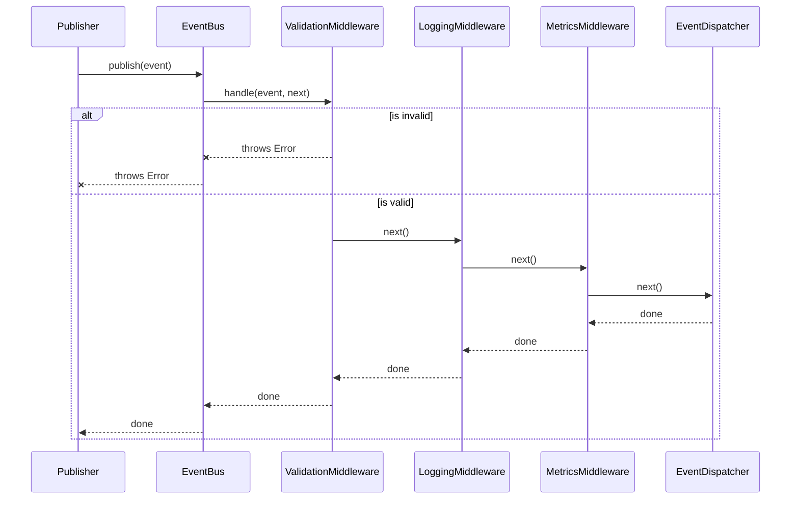

# Middleware

Middleware forms a sequential pipeline through which all events must pass before being dispatched to subscribers.

## Middleware Execution Flow

## Built-in Middleware
1. **ValidationMiddleware:** Ensures the event conforms to the base EventSchema and its specific domain payload schema using Zod. Rejects invalid events immediately.
2. **LoggingMiddleware:** Logs the source, type, and IDs of every event entering the system.
3. **MetricsMiddleware:** Tracks processing time and event counts.
