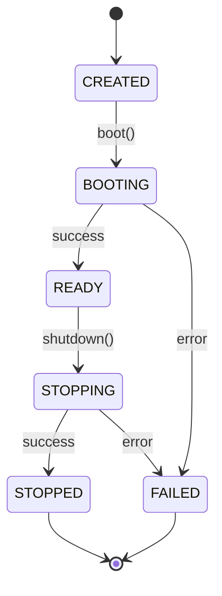

# Startup and Shutdown Lifecycle

## Startup Sequence
The boot process is deterministic and orchestrated by `Bootstrap.ts`.

1. **Configuration**: Load raw env vars (`ConfigLoader`), validate via Zod (`ConfigValidator`), create immutable `ConfigProvider`.
2. **Logging**: Initialize `LoggerFactory` and the root logger.
3. **DI Container**: Create the `ServiceContainer`.
4. **Lifecycle & Events**: Create `LifecycleManager` and `RuntimeEvents`.
5. **Kernel**: Instantiate the `Kernel` with its dependencies.
6. **Shutdown Handler**: Install `SIGINT`/`SIGTERM` hooks via `ShutdownHandler`.
7. **Runtime Context**: Bundle core dependencies into `RuntimeContext`.
8. **Runtime**: Instantiate `Runtime` and register it with `LifecycleManager`.
9. **Health Monitor**: Initialize `HealthMonitor` with built-in checks (Config, Logger, State).
10. **Registration**: Register all created instances into the `ServiceContainer`.
11. **Boot**: Call `Kernel.boot()` to transition state (`CREATED` → `BOOTING` → `READY`) and start all services via `LifecycleManager`.

## RuntimeState Transitions
The runtime state machine is owned by the Kernel:

## Graceful Shutdown
Triggered by `SIGINT` or `SIGTERM`:

1. `ShutdownHandler` intercepts the signal and delegates to `Kernel.shutdown()`.
2. Kernel transitions `READY` → `STOPPING`.
3. Emits `RuntimeStopping` event.
4. `LifecycleManager.stopAll()` executes, stopping services in **reverse registration order**.
5. Emits `RuntimeStopped` event.
6. Kernel transitions `STOPPING` → `STOPPED`.
7. Process exits cleanly with code `0`.

*Note: If shutdown exceeds the configured `SHUTDOWN_TIMEOUT_MS`, the process force-exits with code `1`.*
