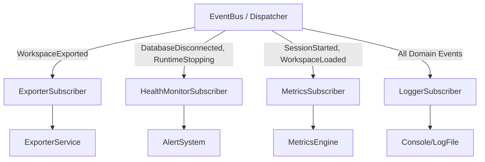

# Subscribers

Subscribers react to events published on the Event Bus.

## Subscriber Interaction Diagram


## Contracts
Each subscriber must implement `EventSubscriber`:
```typescript
export interface EventSubscriber {
  readonly supportedEvents: string[];
  getHandler(eventType: string): EventHandler<Event> | undefined;
}
```

Subscribers do not know about publishers, and publishers do not know about subscribers.
