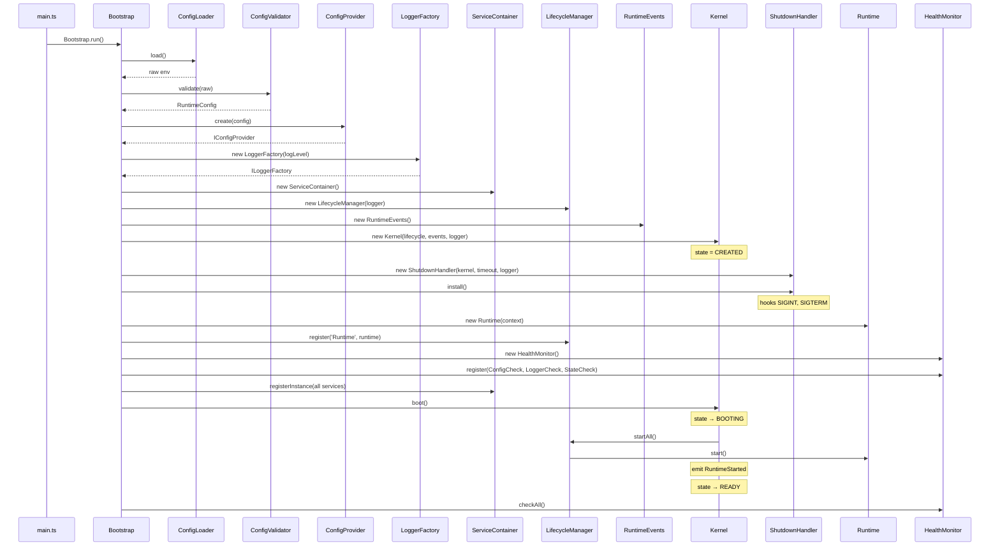
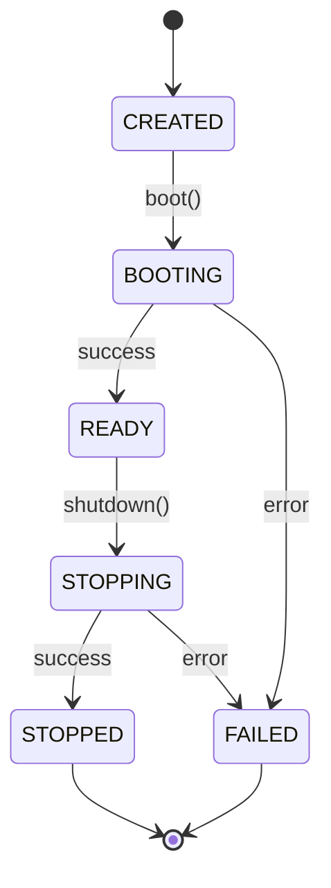

# Engineering Workspace Runtime v2 — Stage 1

Application foundation for the Engineering Workspace Runtime.

## Architecture

Three-layer startup hierarchy with strict inversion of control:

| Layer       | Responsibility                                                                               |
| ----------- | -------------------------------------------------------------------------------------------- |
| **Bootstrap** | Creates all core services, owns the `ServiceContainer`, wires dependencies, hands control to Kernel |
| **Kernel**    | Owns `RuntimeState`, `LifecycleManager`, `RuntimeEvents`. Coordinates startup and shutdown deterministically |
| **Runtime**   | Represents the running application. Receives all dependencies via constructor. Contains no construction logic |

## Folder Structure

```
src/
├── bootstrap/
│   └── Bootstrap.ts            # Entry orchestrator — owns ServiceContainer
├── kernel/
│   ├── Kernel.ts               # Lifecycle coordinator, state owner
│   └── RuntimeState.ts         # State machine enum
├── runtime/
│   └── Runtime.ts              # Running application (ILifecycle)
├── core/
│   ├── config/
│   │   ├── ConfigSchema.ts     # Zod schema
│   │   ├── ConfigLoader.ts     # Reads .env
│   │   ├── ConfigValidator.ts  # Validates via Zod
│   │   ├── ConfigProvider.ts   # Immutable access (IConfigProvider)
│   │   └── index.ts
│   ├── logger/
│   │   ├── LoggerFactory.ts    # Creates loggers (ILoggerFactory)
│   │   ├── ConsoleLogger.ts    # Console implementation (ILogger)
│   │   └── index.ts
│   ├── lifecycle/
│   │   ├── LifecycleManager.ts # Ordered start/stop (ILifecycleManager)
│   │   ├── ShutdownHandler.ts  # SIGINT/SIGTERM handling
│   │   └── index.ts
│   ├── di/
│   │   ├── ServiceContainer.ts # DI container (IServiceContainer)
│   │   ├── ServiceTokens.ts    # Typed service tokens
│   │   └── index.ts
│   ├── events/
│   │   ├── RuntimeEvents.ts    # Synchronous lifecycle events
│   │   └── index.ts
│   └── health/
│       ├── HealthMonitor.ts    # Extensible health checks (IHealthMonitor)
│       └── index.ts
├── interfaces/                 # Contracts (ILogger, ILifecycle, etc.)
├── types/                      # Data models (RuntimeConfig, RuntimeContext, etc.)
├── shared/                     # Future shared utilities
└── main.ts                     # Entry point
```

## Startup Lifecycle



## RuntimeState Transitions



## Graceful Shutdown

On `SIGINT` or `SIGTERM`:

1. `ShutdownHandler` intercepts the signal
2. Delegates to `Kernel.shutdown()`
3. Kernel transitions: `READY → STOPPING`
4. Emits `RuntimeStopping`
5. `LifecycleManager.stopAll()` stops services in **reverse registration order**
6. Emits `RuntimeStopped`
7. Kernel transitions: `STOPPING → STOPPED`
8. Process exits with code 0

If shutdown exceeds `SHUTDOWN_TIMEOUT_MS`, the process force-exits with code 1.

## Adding a New Service

1. Define an interface in `src/interfaces/`
2. Implement the interface in `src/core/` or `src/runtime/`
3. If it has lifecycle needs, implement `ILifecycle`
4. Add a service token in `src/core/di/ServiceTokens.ts`
5. Construct and register the service in `Bootstrap.run()`
6. If lifecycle-aware, register with `lifecycle.register('Name', service)`

## Health Checks

Register new health checks without modifying existing code:

```typescript
const healthMonitor = container.resolve(TOKENS.HealthMonitor);
healthMonitor.register({
  name: 'database',
  check: async () => ({
    healthy: true,
    message: 'Connected',
    details: { latencyMs: 12 },
  }),
});
```

## Environment Variables

| Variable              | Default       | Description                              |
| --------------------- | ------------- | ---------------------------------------- |
| `NODE_ENV`            | `development` | Application environment                  |
| `LOG_LEVEL`           | `info`        | Minimum log level (debug/info/warn/error)|
| `WORKSPACE_ROOT`      | `.`           | Workspace root directory                 |
| `SHUTDOWN_TIMEOUT_MS` | `10000`       | Graceful shutdown timeout in ms          |

## Scripts

```bash
npm run dev           # Start with tsx watch
npm run build         # Compile with tsc
npm test              # Run tests with vitest
npm run lint          # Lint with ESLint
npm run format        # Format with Prettier
npm run format:check  # Check formatting
```
